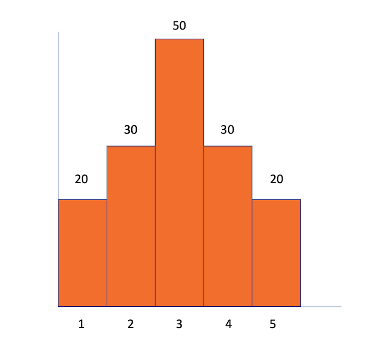

# RandomD
A very simple generic random sample generator that produces samples respecting a certain distribution (that's why the 'D' in the project name).

You can use it for Objects (like Strings), or for numbers.

You can also generate random values in specific ranges, following the same distribution. This only works if the provided values are numbers.

**Remark:** I may be misusing some statistical terms. I am sorry for that. I am not an statician, and I believe you are going to get the message anyway.

## Overview
You can instantiate RandomD either with a set of values and their respective (expected) frequencies, or with a sample of values (and then RandomD is going to compute the frequencies).

After instantiation, you can either use ```get()```, to generate random values in the provided range, or ```getInRange(ini,end)``` to generate values in different ranges, but respecting the provided distribution.

Let me give an example.

Take the distribution below:



You would represent it like this:
~~~
values = [ 1, 2, 3, 4, 5 ];
frequencies = [ 20, 30, 50, 30, 20 ];
~~~
As you can see, the sum of the frequencies is 150. So, you can expect to get:
- 1 in 13.3% (20/150) of the times, 
- 2 in 20% (30/150) of the times, 
- 3 in 33.3% (50/150) of the times,
- 4 in 20% (30/150) of the times, 
- 5 in 13.3% (20/150) of the times.

The class can also generate random numbers in the Real domain, and in different ranges (between arbitrary *min* and *max* values). 

## Features
- Construct an instance by providing one of these:
  - a pair of arrays (values and respective frequencies, as shown in the example), or 
  - an array of values from which the class is going to derive the value's frequencies.
- `get()` is going to generate an integer within the specified range respecting the distribution.
    - The range is the one defined by the range of provided values, either provided directly or via the samples.
- `getInRange(min,max,<optional> Real=true)` is going to give you a random number between abitrary `min` and `max`, also respecting the distribution. here you also can use `getInRange(min,max,'REAL')` to get a Real number.

## How to use

### Instantiation

The example below is an implementation of the example presented below:
~~~
let values = [1,2,3,4,5];
let frequencies = [20,30,50,30,20];
let randGen = new RandomD({
    fromSpecification : {
        "values" : values,
        "frequencies" : frequencies
    }
});
~~~
and here we have the same distribution derived from a sample of data.
~~~
let randGen = new RandomD({
    fromSample : {
        "sample" : [
            1,1,
            2,2,2,
            3,3,3,3,3,
            4,4,4,
            5,5
        ]
    }
});
~~~

### Generating random values

#### **Get** - stick to the provided values

Let's suppose we have the `randGen` object as in the examples above.

Use `randGen.get()` to get a random number in the provided range (in the example above, one of the numbers 1, 2, 3, 4 or 5).

#### **GetInRange** - getting flexible

If you are working with numbers, you can generate random numbers in any range, also respecting the same distribution.

So, let's say that you have instantiated RandomD like before:

~~~
let values = [1,2,3,4,5];
let frequencies = [20,30,50,30,20];
let randGen = new RandomD({
    fromSpecification : {
        "values" : values,
        "frequencies" : frequencies
    }
});
~~~

Now, let's say that you want to generate random numbers in the range between -45 and +73. You do like this:

~~~
randGen.getInRange(-45,73); // if you want integers only
randGen.getInRange(-45,73,'REAL'); if you want real numbers
~~~

Basically, what we are going to do is to create ranges proportional to the distribution values that we have, and generate a random number in that range. 

See, for this example:

| Main range    | 1    | 2    | 3    | 4    | 5    |
| ----          | ---- | ---- | ---- | ---- | ---- |
| Frequencies   | 20   | 30   |  50  |  30  |  20  |
| Custom Ranges | -45 , -21.4 | -21.4 , 2.2 | 2.2 , 25.8 | 25.8 , 49.4 | 49.4 , 73 |

The first thing we do is to select a main range in accordance to the distribution, and then we select an equaly distributed random number within the custom range within that lane.

Let's say that we get 1.35. That means that first we selected the main range number 2, and then that 1.35 was selected within that range.

#### Generating non-numeric random values

Let's get back to the same examples that we have shown before. You can generate the non-numeric values randomly, respecting the provided distribution, like this:
~~~
let values = ["A","B","C","D","E"];
let frequencies = [20,30,50,30,20];
let randGen = new RandomD({
    fromSpecification : {
        "values" : values,
        "frequencies" : frequencies
    }
});
~~~
And, if you are instantiating it from a sample:
~~~
let randGen = new RandomD({
    fromSample : {
        "sample" : [
            "A","A",
            "B","B","B",
            "C","C","C","C","C",
            "D","D","D",
            "E","E"
        ]
    }
});
~~~

Remember that for this case `getInRange` is not going to work (you are going to get a `NaN` as result).